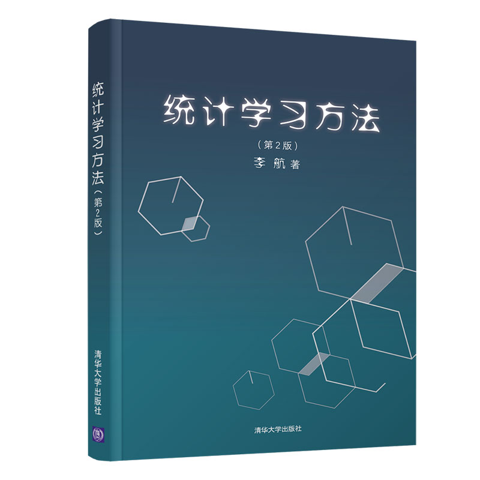
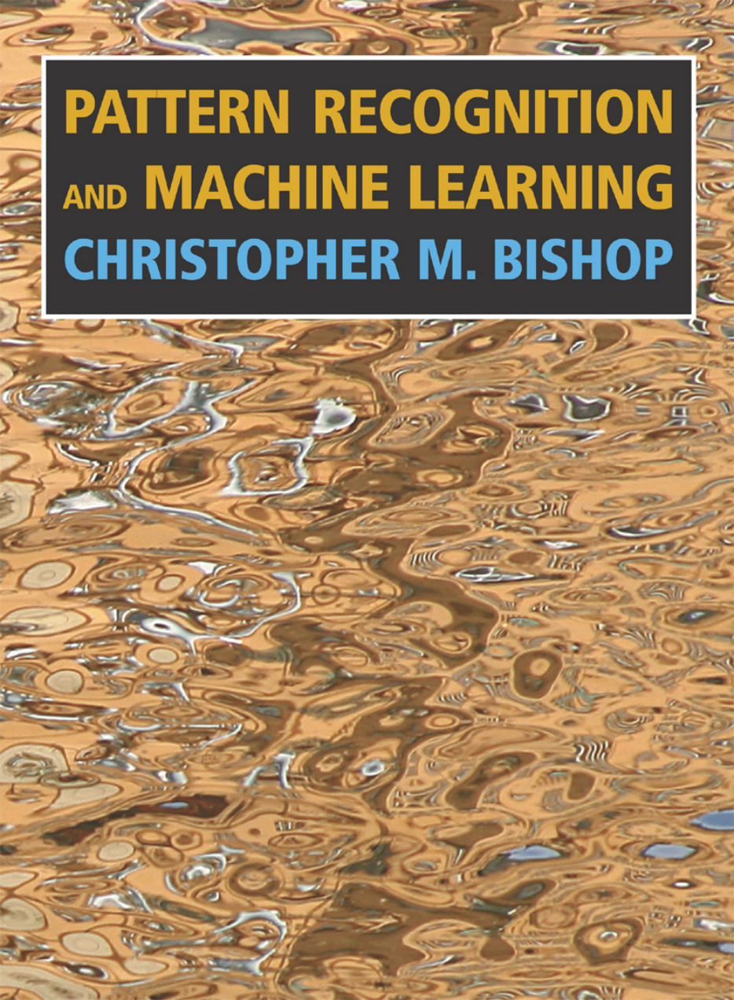
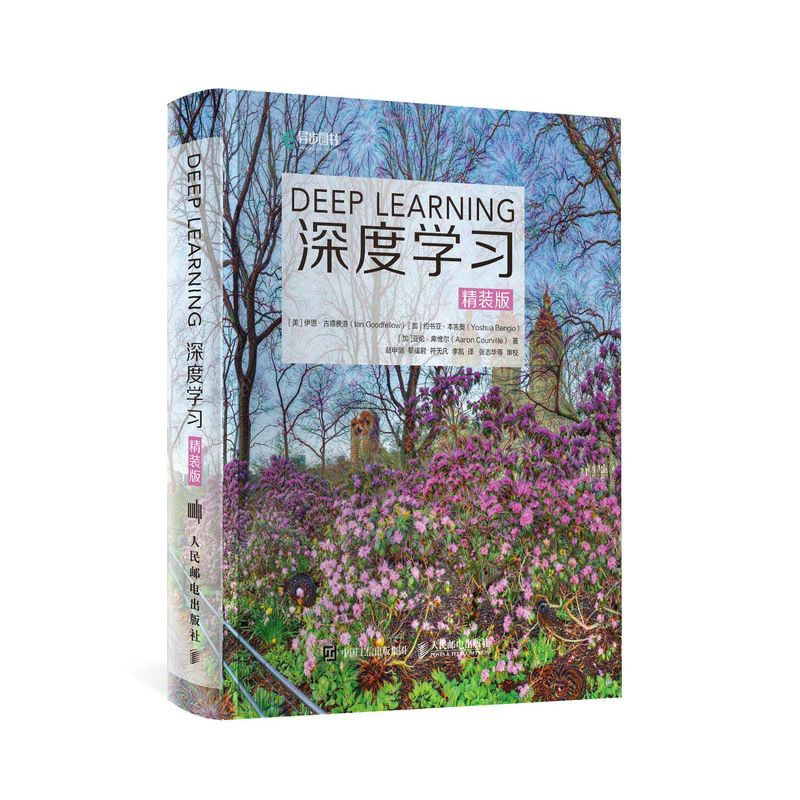
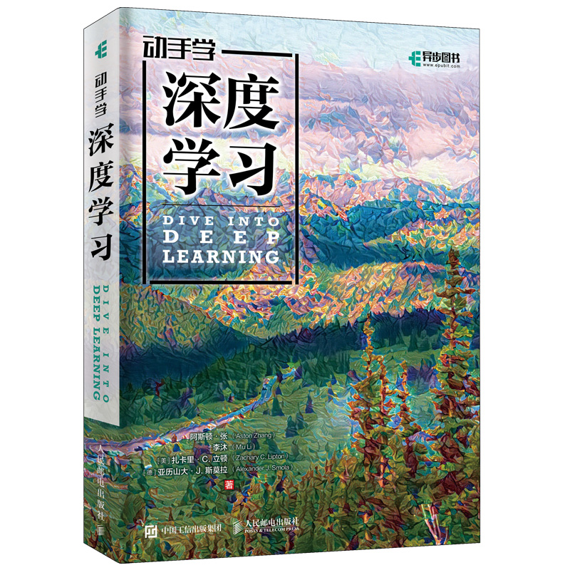
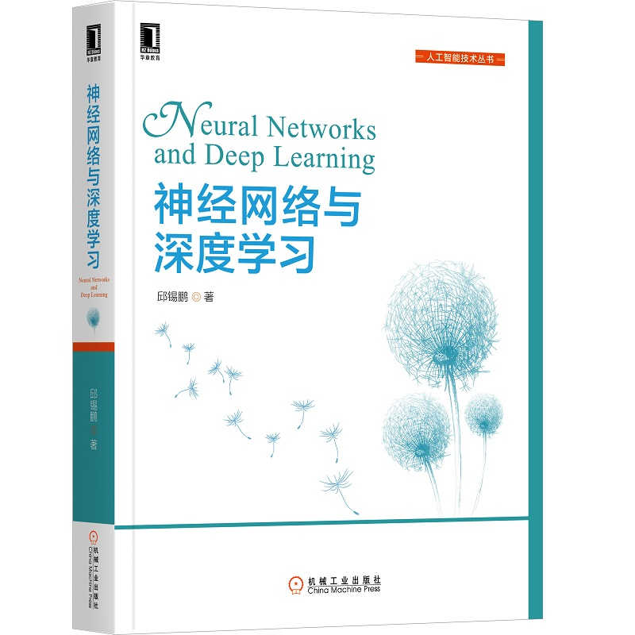
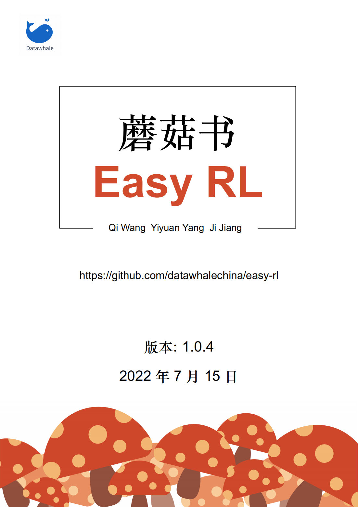
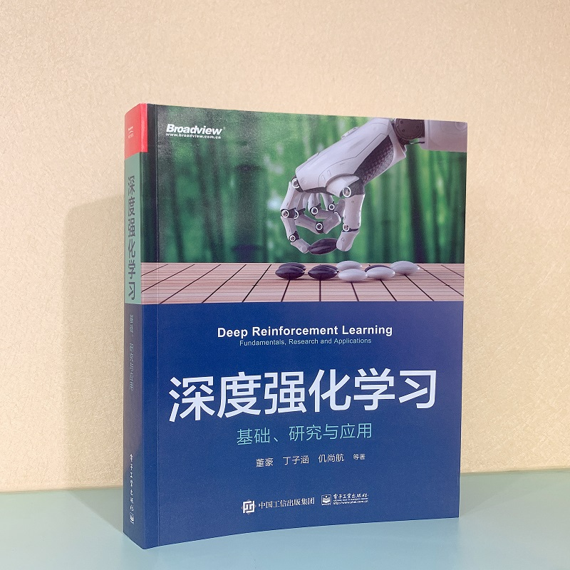
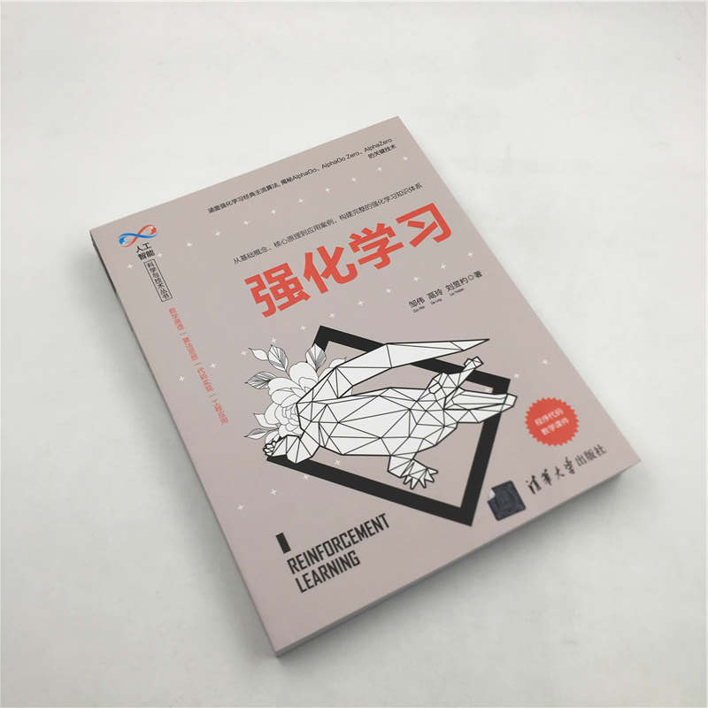
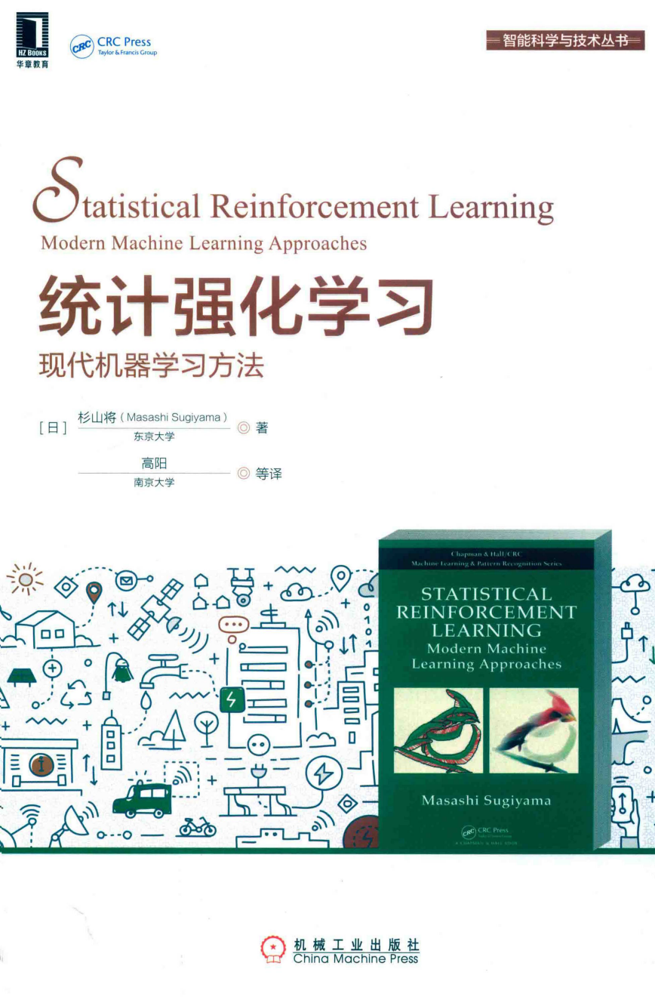

# 
学习建议

[TOC]

## 1. 书籍列表

### 1.1 机器学习

1. 《机器学习》（又名《西瓜书》）周志华，[PDF](books/ML/周志华-机器学习 Machine Learning.pdf)

   

   《南瓜书》DataWhale，[PDF](books/ML/pumpkin_book.pdf) 

   

2. 《统计学习方法》李航，[第一版](books/ML/2012-李航-统计学习方法-第一版.pdf)，[第二版](books/ML/李航-统计学习方法-第二版.pdf)

   

3. 《Pattern Recognition and Machine Learning》（PRML，模式识别与机器学习）Bishop，[原版PDF](books/ML/2006-Bishop-Pattern-Recognition-and-Machine-Learning.pdf)，[中文PDF](books/ML/马春鹏-模式识别与机器学习中文.pdf)

   

4. 《Machine Learning in Action》（机器学习实战）Peter Harrington ，[原版PDF](books/ML/Machine Learning in Action.pdf)，[中文PDF](books/ML/Peter Harrington-机器学习实战.pdf)

   

### 1.2 深度学习

1. 《Deep Learning》（深度学习，又名花书）Ian Goodfellow，[原版PDF](books/DL/2017-MIT-Ian Goodfellow, Yoshua Bengio, Aaron Courville - Deep Learning.pdf)，[中文PDF](books/DL/2017-dlbook_cn_v0.5-beta.pdf)

   

2. 《动手学深度学习》（d2l，Dive into Deep Learning，也叫深入深度学习）李沐，[英文PDF](books/DL/d2l-en.pdf)，[中文PDF](books/DL/d2l-zh-pytorch.pdf)

   

3. 《神经网络与深度学习》（nndl，蒲公英书）邱锡鹏，[PDF](books/DL/nndl-book.pdf) 

   

4. 《Hands-On Machine Learning with Scikit-Learn Keras, and TensorFlow》Aurélien Géron，[原版PDF](books/DL/2019-Hands-On Machine Learning with Scikit-Learn, Keras, and TensorFlow-第二版.pdf)，[中文PDF](books/DL/机器学习实战：基于Scikit-Learn、Keras和TensorFlow：原书第2版 (Aurélien Géron) .pdf) 

   

5. 《Deep Learning with Python》François Chollet，[原版PDF](books/DL/Francois Chollet-Deep Learning with Python.pdf)，[中文PDF](books/DL/Python深度学习.pdf)  

   

   

### 1.3 强化学习

1. 《Reinforcement Learning: An Introduction》（强化学习简介，强化学习导论，强化学习(第二版)）Sutton，[英文PDF](books/RL/RLbook2020.pdf)，[中文PDF(扫描版)](books/RL/《强化学习  第2版》.pdf) 

   

2. 《深度强化学习》（DRL，也叫猫书）王树森，[V1草稿PDF](books/RL/drl_v1.pdf)，[GitHub草稿PDF ](books/RL/DRL.pdf) 

   

3. 《Deep Reinforcement Learning  Hands-On: Apply modern RL methods to practical problems of chatbots,  robotics, discrete optimization, web automation, and more, 2nd Edition》Maxim Lapan

4. 《Easy-RL》（也叫蘑菇书）DataWhale，[PDF](books/RL/EasyRL_v.1.0.4.pdf) 

5. 

6. 《深入浅出强化学习：原理入门》郭宪 方勇纯，[PDF](books/RL/郭宪-方勇纯-深入浅出强化学习：原理入门.pdf) 

   

7. 《深度强化学习：基础、研究与应用》董豪，[PDF](books/RL/董豪-深度强化学习：基础、研究与应用.pdf) 

   

8. 《深度强化学习核心算法与应用》陈世勇, 苏博览，杨敬文，[PDF](books/RL/陈世勇, 苏博览，杨敬文-深度强化学习核心算法与应用.pdf) 

   

9. 《强化学习》威宁, 赵地等译，[PDF](books/RL/威宁, 赵地-强化学习.pdf)  

   

10. 《强化学习》邹伟, 鬲玲, 刘昱杓，[PDF](books/RL/邹伟, 鬲玲, 刘昱杓-强化学习.pdf) 

    

11. 《强化学习入门：从原理到实践.pdf》叶强, 闫维新, 黎斌，[PDF](books/RL/叶强, 闫维新, 黎斌-强化学习入门：从原理到实践.pdf) 

    

12. 《统计强化学习：现代机器学习方法》杉山将，[PDF](books/RL/杉山将-统计强化学习：现代机器学习方法.pdf) 

    

等等。